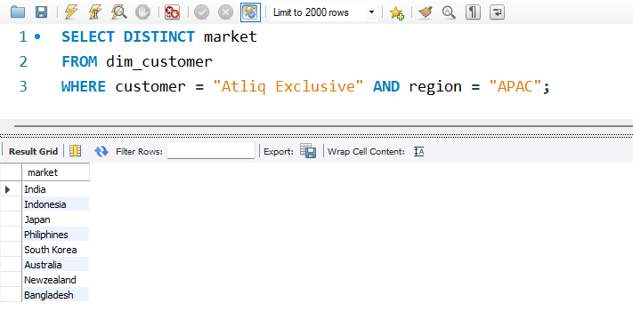
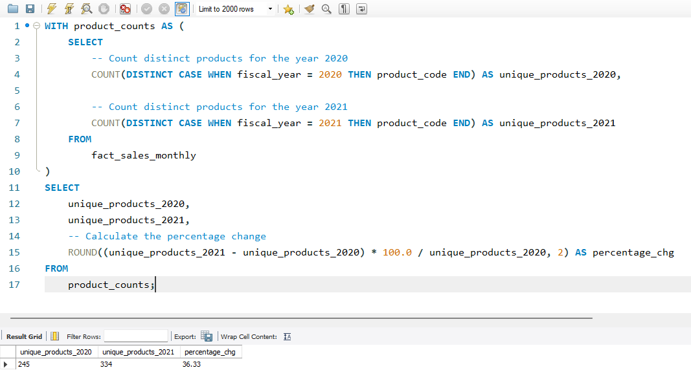
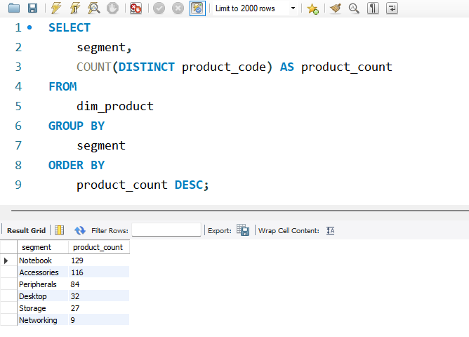
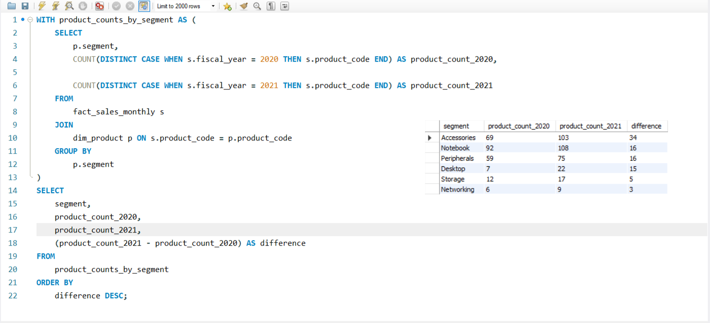
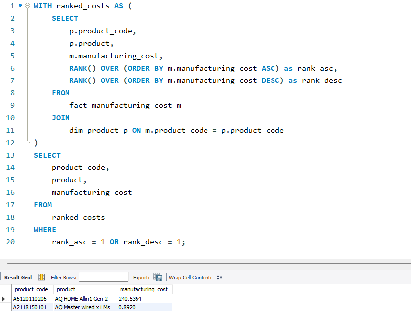
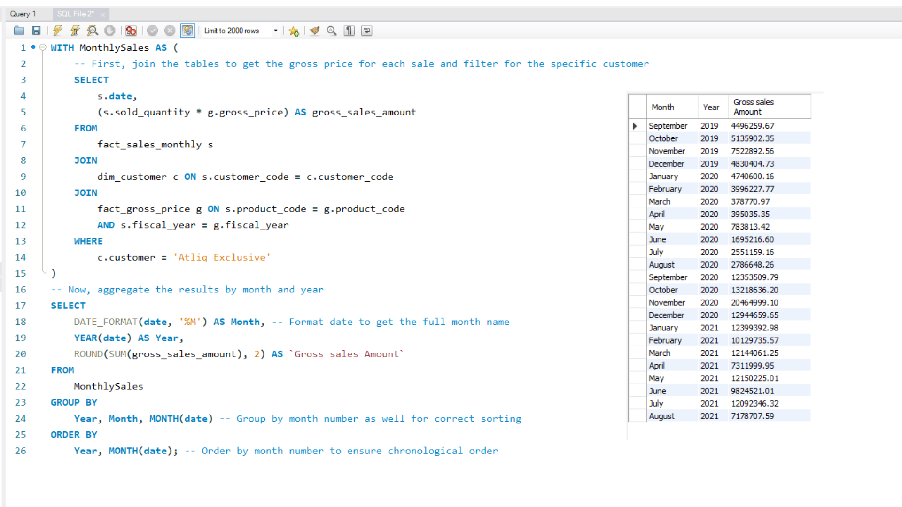
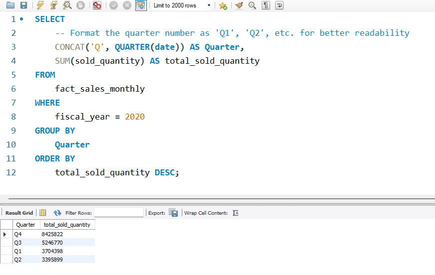
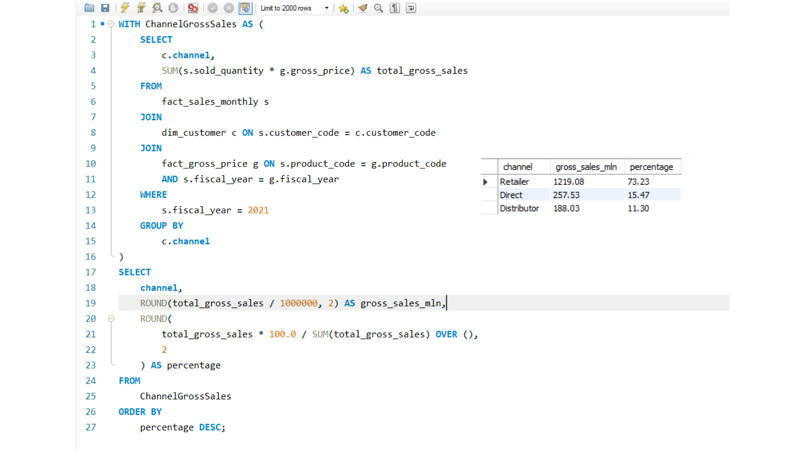
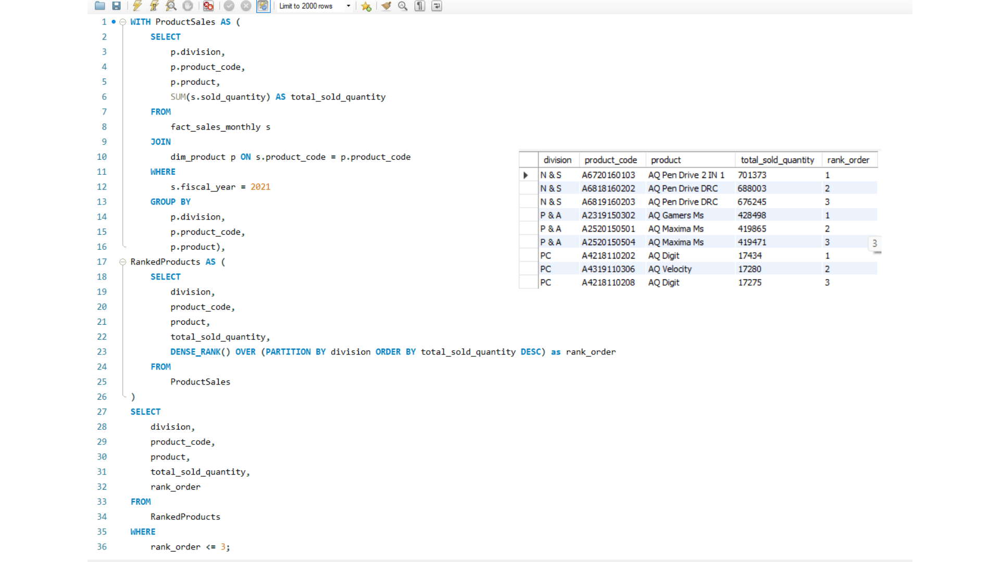

<div align="center">
  <h1>Business Insights with Advanced SQL – AtliQ Hardware 📊</h1>
</div>

<div align="center">
A hands-on SQL project delivering actionable business insights for a global hardware company, showcasing the journey from raw data to strategic decision-making.
  
</div>

---

## 📖 Table of Contents

- [Project Overview](#-project-overview)
- [Analyst Approach](#-analyst-approach)
- [10 Business Requests & SQL Solutions](#-10-business-requests--sql-solutions)
- [Key Insights](#-key-insights)
- [Skills Highlight](#-skills-highlight)
- [Repository Layout](#-repository-layout)
- [Connect with Me](#-connect-with-me)

---

## 🎯 Project Overview

**AtliQ Hardware** is a fast-expanding global computer hardware manufacturer, operating across retail outlets, e-commerce platforms, and direct B2B sales.  

The company wanted to move beyond intuition-driven decisions and leverage **data to answer pressing business questions**.  

In this project, I acted as a data analyst to address **10 specific business queries** using **advanced SQL techniques**, analyzing over **1.5 million rows of data** to extract meaningful insights that could guide strategic decisions.

---

## 💡 Analyst Approach

Successful data analysis starts with understanding the **business context** and the **stakeholders’ needs**. Key steps in this project included:

* Clarifying the **objective**: What each request aimed to achieve.  
* Defining **success metrics**: How results would be interpreted for decisions.  
* Understanding **stakeholder perspective**: Who will use these insights and how.  
* Identifying **data requirements & sources**: Tables, joins, and calculations needed.  
* Anticipating **data challenges**: Missing values, inconsistencies, and large dataset handling.

This structured approach ensured that the queries produced **reliable and actionable outputs**.

---

## 📋 10 Business Requests & SQL Solutions

Below are the **10 business questions**, along with the SQL approach and result screenshots.  

1. **Market Analysis:** List markets where “AtliQ Exclusive” operates in APAC. **[Query](Solutions/1_market_analysis_apac.sql)**  
   <details><summary>View Result</summary></details>

2. **Product Performance:** Percentage increase in unique products in 2021 vs 2020. **[Query](Solutions/2_unique_product_increase.sql)**  
   <details><summary>View Result</summary></details>

3. **Product Segmentation:** Count of unique products per segment (descending). **[Query](Solutions/3_product_count_by_segment.sql)**  
   <details><summary>View Result</summary></details>

4. **Segment Growth:** Which segment had the largest increase in unique products (2020–2021)? **[Query](Solutions/4_segment_growth_analysis.sql)**  
   <details><summary>View Result</summary></details>

5. **Manufacturing Cost:** Products with highest and lowest manufacturing cost. **[Query](Solutions/5_manufacturing_cost_extremes.sql)**  
   <details><summary>View Result</summary></details>

6. **Customer Discounts:** Top 5 Indian customers with the highest average pre-invoice discount (FY21). **[Query](Solutions/6_top_5_customer_discounts.sql)**  
   <details><summary>View Result</summary></details>

7. **Monthly Sales Trend:** Gross sales per month for “AtliQ Exclusive”. **[Query](Solutions/7_monthly_gross_sales_report.sql)**  
   <details><summary>View Result</summary></details>

8. **Quarterly Sales:** Which quarter in 2020 had maximum total sold quantity? **[Query](Solutions/8_max_quantity_quarter_2020.sql)**  
   <details><summary>View Result</summary></details>

9. **Channel Contribution:** Channel-wise gross sales and percentage contribution in FY21. **[Query](Solutions/9_channel_contribution_2021.sql)**  
   <details><summary>View Result</summary></details>

10. **Division Performance:** Top 3 products by total sold quantity per division (FY21). **[Query](Solutions/10_top_3_products_by_division.sql)**  
    <details><summary>View Result</summary></details>

---

## 🔑 Key Insights

- **Retailer Channel Leads:** Largest revenue source for FY21.  
- **Notebook Segment Growth:** Biggest increase in unique product offerings (2020–2021).  
- **Top Quarter:** Q2 of 2020 had the highest sales volume.  
- **High-Discount Customers:** Top 5 Indian customers received significantly higher average discounts, highlighting margin opportunities.

---

## 🛠 Skills Highlight

| Category | Techniques & Tools |
|---|---|
| **Advanced SQL** | Joins, Window Functions (`RANK()`, `DENSE_RANK()`, `ROW_NUMBER()`), CTEs, Subqueries |
| **Data Aggregation** | `GROUP BY`, `SUM()`, `COUNT(DISTINCT)`, `AVG()`, `MAX()` |
| **Analytical Thinking** | Time-series analysis, Top-N per category, Contribution analysis, Year-over-Year comparisons |
| **Data Manipulation** | Conditional logic (`CASE`), Date functions (`YEAR`, `QUARTER`), Complex joins |

---

## 📂 Repository Layout

```bash
📁 Business-Insights-with-Advanced-SQL
├── 📁 solutions/ # SQL scripts for each request
├── 📁 results/ # Screenshots of query outputs
├── 📁 slides/ # Presentation deck 
└── README.md # Project overview
```


---

## 📫 Connect with Me

I’m passionate about turning complex datasets into **actionable business insights**. Feel free to reach out or connect!

- **Email:** <mohammedgovani18@gmail.com>  
- **LinkedIn:** <https://www.linkedin.com/in/razagovani/>  
- **GitHub:** <https://github.com/gRaza25>  
